# CVAT - инструмент аннотирования компьютерного зрения

Существует несколько способов использования cvat – общедоступный сайт или развертывание приложения локально.

## Общедоступная версия
Для того, чтобы использовать cvat в общедоступном режиме, необходимо перейти по ссылке https://app.cvat.ai/auth/login и зарегистрироваться/войти в аккаунт. Возможно войти с помощью github- или google-аккаунта.

## Установка локально
Для Linux (Ubuntu):
Введите приведенные ниже команды в окно терминала, чтобы установить Docker и Docker Compose. Дополнительные инструкции можно найти <a href='https://docs.docker.com/engine/install/ubuntu/'> здесь </a>.

```bash
sudo apt-get update
sudo apt-get --no-install-recommends install -y \
  apt-transport-https \
  ca-certificates \
  curl \
  gnupg-agent \
  software-properties-common
curl -fsSL https://download.docker.com/linux/ubuntu/gpg | sudo apt-key add -
sudo add-apt-repository \
  "deb [arch=amd64] https://download.docker.com/linux/ubuntu \
  $(lsb_release -cs) \
  stable"
sudo apt-get update
sudo apt-get --no-install-recommends install -y \
  docker-ce docker-ce-cli containerd.io docker-compose-plugin

```

Введите следующие команды после установки , чтобы запустить докер без прав root.

```bash
sudo groupadd docker
sudo usermod -aG docker $USER
```

Выйдите из системы и войдите снова (или перезагрузитесь), чтобы переоценить ваше членство в группе. После этого вы можете ввести groups команду в окне терминала и проверить есть ли docker группа в ее выводе.

Следующая команда клонирует последнюю ветку разработки CVAT из репозитория на GitHub:

```bash
git clone https://github.com/opencv/cvat
cd cvat
```

Запустите докер-контейнеры. Загрузка последней версии CVAT и других необходимых образов, таких как postgres, redis и т. д., из DockerHub и создание контейнеров займет некоторое время.

```bash
docker compose up -d
```

После поднятия всех контейнеров, CVAT станет доступен на localhost:8080.
Посмотреть установку для других ОС можно по ссылке: https://opencv.github.io/cvat/docs/administration/basics/installation/.

## Создание проекта
В CVAT вы можете создать проект, содержащий однотипные задачи. Все задачи, связанные с проектом, наследуют список меток.
Чтобы создать проект, перейдите в раздел проектов, нажав на Projects пункт в верхнем меню. На странице проектов вы можете увидеть список проектов, воспользоваться поиском или создать новый проект, нажав на кнопку +и выбрав Create New Project.


Вы можете изменить название проекта, а также добавить свой список меток

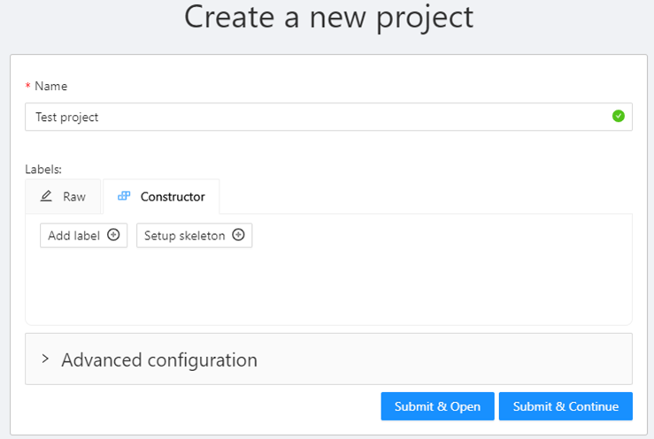


## Создание задачи для аннотации
Чтобы начать аннотировать в CVAT, нужно создать задачу аннотирования и указать ее параметры.
Чтобы создать задачу, на странице Tasks нажмите + и выберите Create a new task.

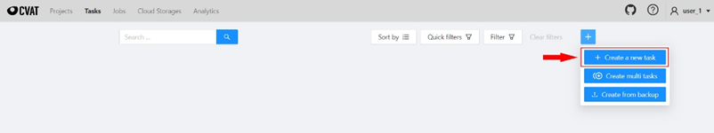

Также, если задача должна быть прикреплена к проекту, ее можно создать со страницы Projects.

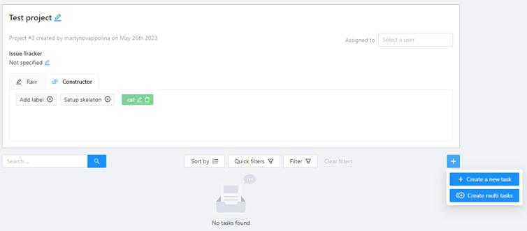

Далее в окне конфигурации задачи заполните все необходимые поля.

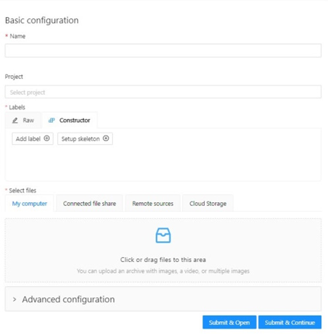

Существует несколько способов загрузки файлов, одним из способов является загрузка файлов с компьютера.

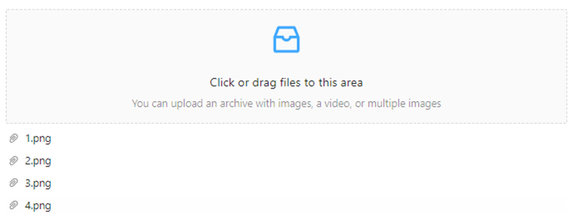

Задачу можно разбить на подзадачи, для этого в разделе Advanced configuration нужно выбрать количество изображений, которые будут входить в одну подзадачу (segment size).


Созданная задача выглядит следующим образом:

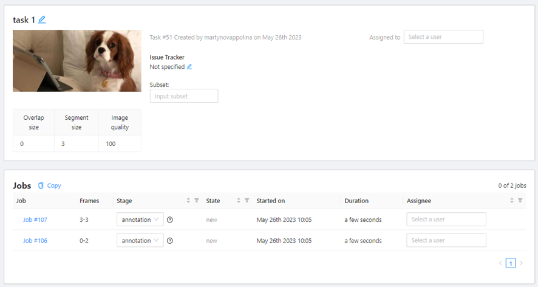

Следует заметить, что импортировать можно не только изображения, но и видео.

## Разметка изображений
Есть несколько способов аннотации изображения: <br />

•	Rectangle или Bounding box<br />
•	Polygon<br />
•	Polyline<br />
•	Points<br />
•	Ellipse<br />
•	Cuboid<br />
•	Cuboid in 3d task<br />
•	Skeleton<br />
•	Tag<br />

Кнопки для выбора инструмента разметки располагаются на боковой панели.
Для разметки прямоугольниками надо нажать следующую кнопку, далее – Shape.

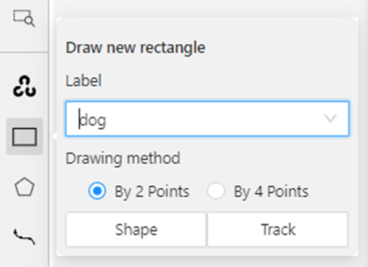


Для задач сегментации подходит вариант разметки – выделение полигонов. Для этого надо нажать следующую кнопку, далее – Shape.


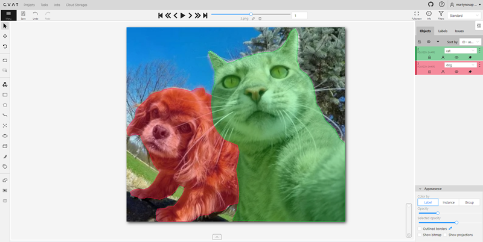

Примеры других типов разметки можно посмотреть в официальной документации CVAT.

Для того, чтобы исправить текущую метку, нужно нажать на нее пкм и выбрать новую метку.


На боковой панели объектов вы можете увидеть список доступных объектов в текущем кадре. На следующем рисунке показан пример того, как может выглядеть список:


Для того, чтобы посмотреть детали задачи, нужно нажать на кнопку info в правом верхнем углу.


На всплывающем окне будет отображаться информация о количестве меток каждого типа.


## Экспорт/импорт наборов данных и загрузка аннотаций
### Экспорт датасета
Вы можете экспортировать набор данных из проекта, задачи или задания.
1)	Чтобы экспортировать последние аннотации, сначала необходимо сохранить все изменения. Нажмите Save кнопку. 

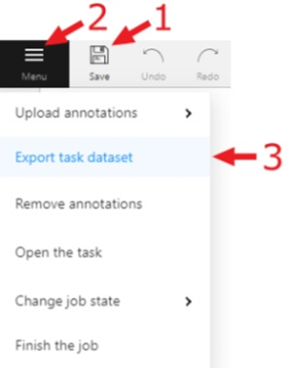

2) После этого нажмите Menu кнопку. Экспорт и импорт наборов данных задач и проектов осуществляется через Action меню.
3)	Нажмите Export task dataset кнопку.

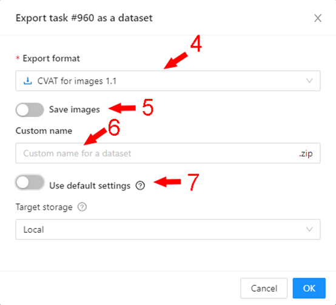

4)	Выберите формат для экспорта набора данных и заполните прочие поля

### Импорт датасета
Вы можете импортировать набор данных только в проект. В этом случае данные будут разбиты на подмножества. Чтобы импортировать набор данных, выполните на странице следующие действия Project:

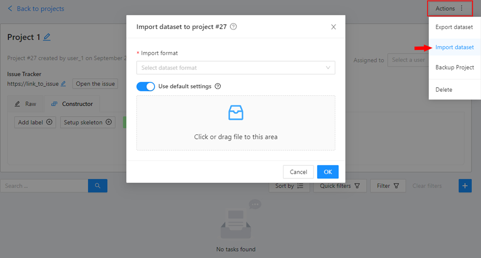

1)	Откройте Actions меню.
2)	Нажмите Import dataset кнопку.
3)	Выберите формат набора данных (если вы не указали пользовательское имя при экспорте, формат будет в имени архива).
4)	Перетащите файл в область загрузки файлов или щелкните область загрузки, чтобы выбрать файл в проводнике.

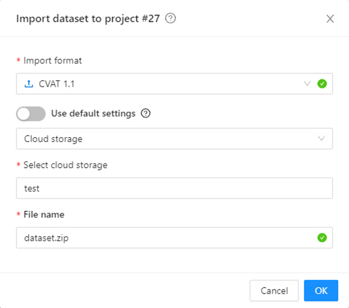

Вы также можете импортировать набор данных из подключенного облачного хранилища.

### Импорт аннотации
В задаче или подзадаче вы можете загрузить аннотацию. Для этого выберите пункт Upload annotation в меню Action выберите формат, в котором вы планируете загружать аннотацию и через проводник выберите файл аннотации или архив. Или вы также можете использовать подключенное облачное хранилище для загрузки файла аннотации.

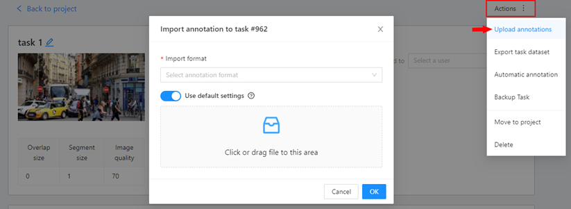


## Создание организации
Для того, чтобы у нескольких пользователей был доступ к одному и тому же проекту, можно создать новую организацию.
Чтобы создать организацию, откройте меню пользователя, перейдите Organizationи нажмите Create.

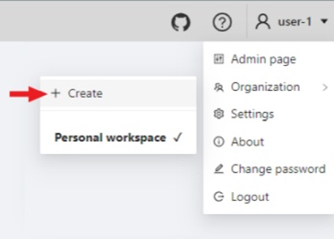

Заполните необходимую информацию, чтобы создать свою организацию. Вам необходимо ввести название Short nameорганизации, которое будет отображаться в меню. Можно указать и другие поля: Full Name, Descriptionи контакты организации. Из них будут видны на странице настроек организации.

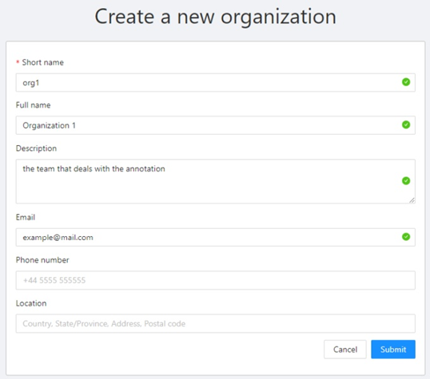

Чтобы перейти на страницу организации, откройте меню пользователя, перейдите Organizationи нажмите Settings.


Чтобы добавить участников, нажмите Invite members. В появившемся окне введите адрес электронной почты пользователя, которого хотите добавить, и выберите роль (роль определяет набор правил):
•	Worker- работники имеют доступ только к назначенным им задачам, проектам и заданиям.
•	Supervisor- эта роль позволяет создавать и назначать рабочие места, задачи и проекты членам организации.
•	Maintainer- участник с этой ролью имеет все возможности супервайзера роли, видит все задачи и проекты, созданные другими членами организации, имеет полный доступ к функции и может изменять Cloud Storagesучастников и их роли.
•	Owner- роль, отведенная создателю организации с максимальными возможностями.

После того, как вы добавите участников, они появятся на странице настроек вашей организации с перечислением каждого участника и информацией о деталях приглашения. Вы можете изменить роль участника или удалить участника в любое время.

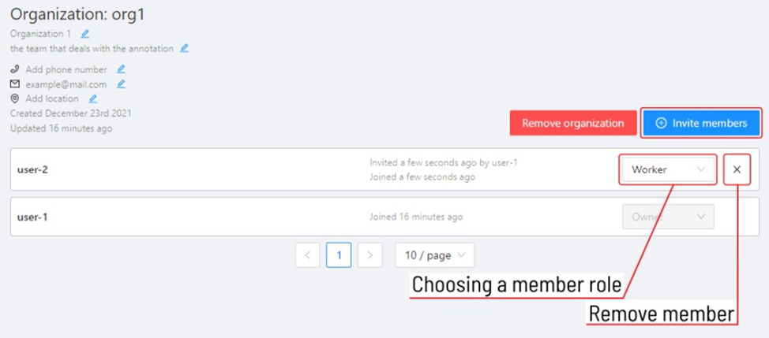

В проектах, созданных в организации на определенные задачи и подзадачи можно назначать пользователей.

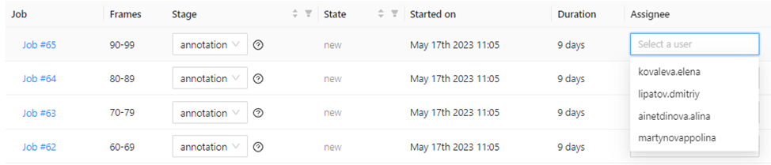

## Полезные ссылки
•	Официальная документация cvat: https://opencv.github.io/cvat/docs/