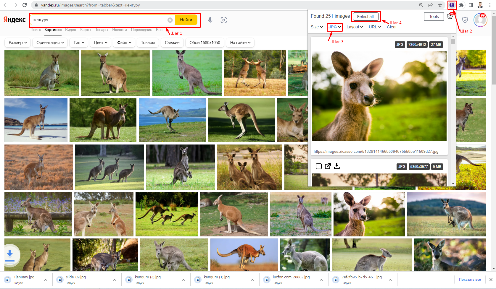
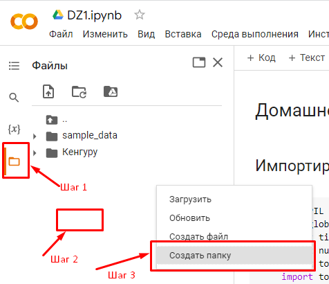
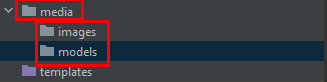
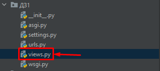
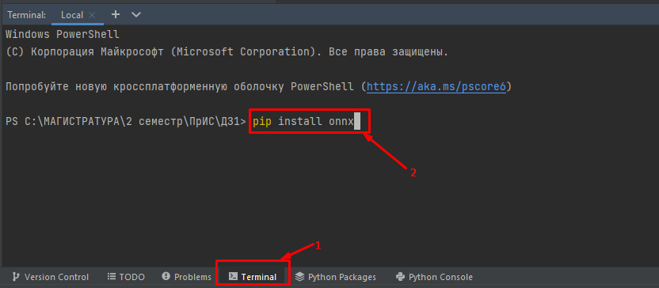
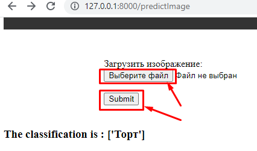

# Домашнее задание №1
## Команда курса благодарит Звонарева Алексея и Лычагина Дмитрия за активное участие в подготовке данного руководства.
## Задание
Необходимо создать и разметить собственный набор данных, состоящий из изображений. Набор содержит не менее 3 классов и не менее 100 экземпляров каждый. Изображения можно скачать из интернета или объединить несколько существующих датасетов. Создать web-приложение для классификации изображений полученного набора данных. Использовать аугментацию данных, регуляризацию, перенос обучения.
## Контрольные вопросы
1. Структура набора данных, аугментация данных.
2. Перенос обучения, дообучение.
3. Архитектура сверточной нейронной сети.
## Установка IDE PyCharm Professional
Для выполнения лабораторной работы потребуется [PyCharm Professional](https://www.jetbrains.com/pycharm/download/#section=windows//).

Студенческую лицензию можно получить, указав бауманскую почту.
## Часть 1
### Загрузка изображений
+ **Вариант 1**. Требуется в одной из поисковых систем найти картинки по требуемым классам, затем скачать вручную в 3 разные папки.
+ **Вариант 2**. Требуется установить одно из расширений Chrome: [Image downloader - Imageye](https://chrome.google.com/webstore/detail/image-downloader-imageye/agionbommeaifngbhincahgmoflcikhm?hl=en-US//) или [Image Downloader](https://chrome.google.com/webstore/detail/image-downloader/cnpniohnfphhjihaiiggeabnkjhpaldj?hl=en-US//). После установки найти изображения в одной из поисковых систем, затем при помощи загруженного ранее расширения загрузить картинки.

#### Шаг 1
В любой из поисковых систем выполнить поиск картинок на интересующую тему.
#### Шаг 2
Открыть ранее установленное расширение.
#### Шаг 3
Выбрать тип изображения JPG.
#### Шаг 4
Выбрать все картинки и скачать.
+ **Вариант 3**. Требуется установить библиотеку Python: [yandex-images-download](https://pypi.org/project/yandex-images-download/?msclkid=b0148afab45011ec8358c9751dabcf63//) ([GitHub](https://github.com/doevent/yandex-images-downloader/?msclkid=b0155486b45011eca4a25458cfa90a0e//)). После установки библиотеки необходимо скачать [ChromeDriver](https://chromedriver.chromium.org/?msclkid=c622b0f0b45011ec8c6768a6d02ae314//) для Вашей версии Google Chrome и распаковать файл chromedriver.exe. В командной строке PyCharm ввести следующую команду: *yandex-images-download Chrome --keywords "Торт, Ласточка, Кошка" --limit 100* (пример альтернативной команды: *yandex-images-download Chrome --keywords "ласточка, орёл, торты" -o путь_для_скачивания -l количество фотографий -dp путь_к_chromedriver.exe*).
### Валидация изображения
После успешной загрузки изображений требуется очистить лишние объекты в ручном режиме на предмет возможных ошибок (дубликация, неверная тематика).
### Импортирование изображений в Google Colab 
#### Шаг 1
Требуется перейти по ссылке на подготовленный [проект](https://github.com/iu5git/Deep-learning/blob/main/homework/homework.ipynb) и сохранить себе копию на Google диск.
#### Шаг 2
В файловой системе Colab-файла в папке "content" необходимо создать три папки, согласно классам тематики Ваших изображений (пример: "Торт, Ласточка, Кошка") и загрузить туда скаченные ранее изображения. 


Открываем файловую систему в Colab (автоматически откроется папка "content"). Нажимаем ПКМ в свободном пространстве и создаем папки по тематике классов.
#### Шаг 3
Изменить переменную класса под свою тематику.
### Модернизация исходной модели в Colab
Требуется выполнить аугментацию, регуляризацию и перенос обучения и сохранить модель в формате ONNX.

## Часть 2
### Создание web-приложения для классификации изображений полученного набора данных
#### Шаг 1
Пример создания проекта Django в IDE Pycharm можно просмотреть по данной [ссылке](https://github.com/iu5team/iu5web-fall-2021/blob/main/tutorials/lab4/lab4_tutorial.md#%D0%BC%D0%B5%D1%82%D0%BE%D0%B4%D0%B8%D1%87%D0%B5%D1%81%D0%BA%D0%B8%D0%B5-%D1%83%D0%BA%D0%B0%D0%B7%D0%B0%D0%BD%D0%B8%D1%8F-%D0%BF%D0%BE-%D0%B2%D1%8B%D0%BF%D0%BE%D0%BB%D0%BD%D0%B5%D0%BD%D0%B8%D1%8E-%D0%BB%D0%B0%D0%B1%D0%BE%D1%80%D0%B0%D1%82%D0%BE%D1%80%D0%BD%D0%BE%D0%B9-%D1%80%D0%B0%D0%B1%D0%BE%D1%82%D1%8B-4//).
#### Шаг 2
После создания проекта требуется создать в корне проекта папку media для последующего сохранения изображений и файлов формата ONNX. Внутри папки media необходимо создать папки "images" и "models".


#### Шаг 3
В файл setting.py требуется добавить пути к ранее созданной папке media. В самом конце необходимо добавить следующий блок кода:

```python
import os

MEDIA_URL = '/media/'
MEDIA_ROOT = os.path.join(os.path.dirname(os.path.dirname(os.path.abspath(__file__))), 'media')
```

#### Шаг 4
Добавить Python файл views.py в ту же папку, где был файл setting.py.



```python
from django.shortcuts import render
from django.core.files.storage import FileSystemStorage
import onnxruntime
import numpy as np
from PIL import Image

imageClassList = {'0': ['Торт'], '1': ['Ласточка'], '2': ['Кошка']}  #Сюда указать классы

def scoreImagePage(request):
    return render(request, 'scorepage.html')

def predictImage(request):
    fileObj = request.FILES['filePath']
    fs = FileSystemStorage()
    filePathName = fs.save('images/'+fileObj.name,fileObj)
    filePathName = fs.url(filePathName)
    modelName = request.POST.get('modelName')
    scorePrediction = predictImageData(modelName, '.'+filePathName)
    context = {'scorePrediction': scorePrediction}
    return render(request, 'scorepage.html', context)

def predictImageData(modelName, filePath):
    img = Image.open(filePath).convert("RGB")
    img = np.asarray(img.resize((32, 32), Image.ANTIALIAS))
    sess = onnxruntime.InferenceSession(r'C:\DZ1\media\models\cifar100.onnx') #<-Здесь требуется указать свой путь к модели
    outputOFModel = np.argmax(sess.run(None, {'input': np.asarray([img]).astype(np.float32)}))
    score = imageClassList[str(outputOFModel)]
    return score
```

##### Шаг 4.1
В файле views.py изменить классы по Вашей тематике и указать путь к модели ONNX.

```python
imageClassList = {'0': ['Торт'], '1': ['Ласточка'], '2': ['Кошка']}  #Сюда указать классы
```

```python
sess = onnxruntime.InferenceSession(r'C:\DZ1\media\models\cifar100.onnx') #<-Здесь требуется указать свой путь к модели
```

#### Шаг 5
В файле urls.py требуется заменить содержимое на следующий блок кода:

```python
from django.contrib import admin
from django.urls import path
from django.conf.urls.static import static
from django.conf import settings
from . import views
urlpatterns = [
    path('admin/', admin.site.urls),
    path('', views.scoreImagePage, name='scoreImagePage'),
    path('predictImage', views.predictImage, name='predictImage'),
]

urlpatterns += static(settings.MEDIA_URL, document_root=settings.MEDIA_ROOT)
```

#### Шаг 6
Установить следующие библиотеки: onnx, onnxruntime, numpy, pillow.
Пример установки одной библиотеки:


#### Шаг 7
В папку templates добавить файл scorepage.html.

```html
<!DOCTYPE html>
<html lang="ru">
<head>
<meta charset="windows-1251">
<title>Домашнее задание 1</title>
<style>
    /* Add some padding on document's body to prevent the content
    to go underneath the header and footer */
    body{        
        padding-top: 60px;
        padding-bottom: 40px;
    }
    .fixed-header, .fixed-footer{
        width: 100%;
        position: fixed;        
        background: #333;
        padding: 10px 0;
        color: #fff;
    }
    .fixed-header{
        top: 0;
    }
    .fixed-footer{
        bottom: 0;
    }
    .container{
        width: 80%;
        margin: 0 auto; /* Center the DIV horizontally */
    }
    nav a{
        color: #fff;
        text-decoration: none;
        padding: 7px 25px;
        display: inline-block;
    }
</style>
</head>
<body>
    <div class="fixed-header">
        <div class="container">

        </div>
    </div>
    <div class="container">
        <form action="predictImage" method="post" enctype="multipart/form-data">
            

            <div class="col-md-4 col-sm-4">
                <label for="FilePath">Загрузить изображение:</label>
            </div> <input name="filePath" type="file"><br><br>
            <input type="submit" value="Submit" >
        </form>
    </div>    
    <div>
        <br>
        
        <h3>The classification is : {{scorePrediction}}</h3>
        
       
    </div>
    <div class="fixed-footer">
        <div class="container"></div>        
    </div>
</body>
</html>
```
#### Шаг 8
Запустить проект, выполнив в терминале PyCharm следующую команду: "python3 manage.py runserver".

#### Шаг 9
Загрузить изображение и нажать на кнопку "submit".


