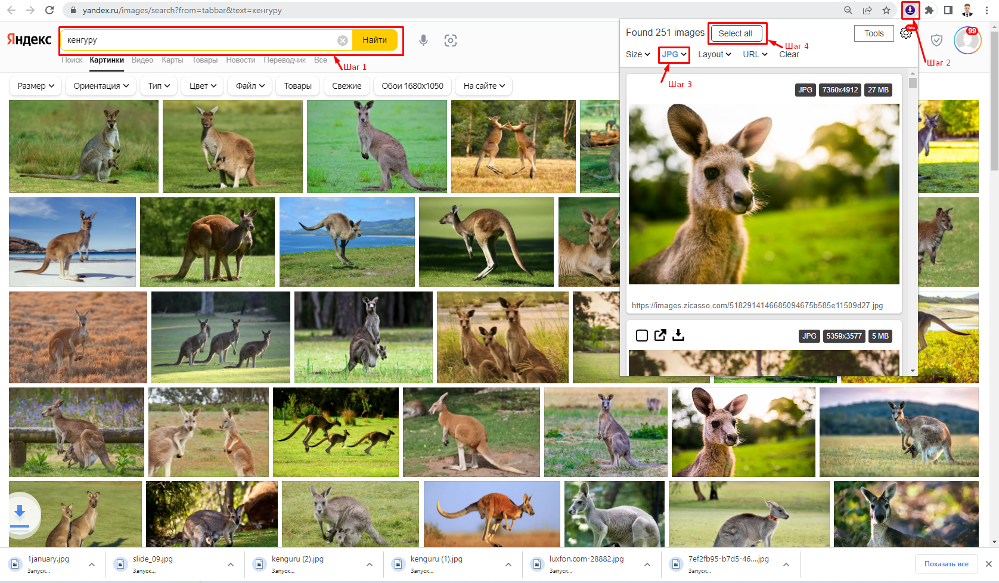
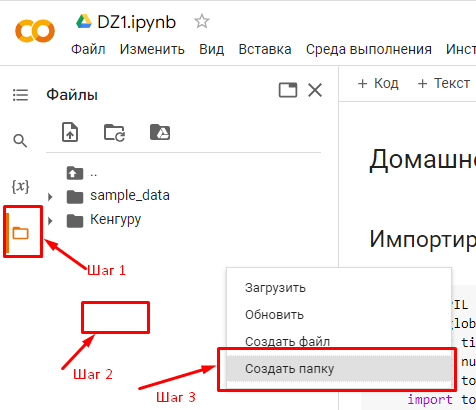

# 家庭作业第1号
*自动翻译，可能存在错误。*

## 任务
您需要创建并标注自己的图像数据集。数据集必须包含**至少3个类别**，每个类别**至少100个实例**。图像可以从互联网下载，也可以通过合并多个现有数据集来获取。在您的自定义数据集上训练模型。创建一个用于图像分类的Web应用程序，使用所收集的数据集。使用数据增强、正则化和迁移学习。

## 复习问题
1. 数据集结构、数据增强。
2. 迁移学习、微调。
3. 卷积神经网络架构。

---

## 第1部分：数据集收集与准备

### 图像下载

获取数据集图像有多种方式。请选择最适合您的方式：

**方式一：手动收集**

在搜索引擎（Yandex.Images、Google Images）中根据您的类别主题搜索图像，并手动下载，整理到三个独立的文件夹中。

**方式二：使用浏览器扩展**

安装批量下载图像的浏览器扩展，例如：
- [Image downloader - Imageye](https://chrome.google.com/webstore/detail/image-downloader-imageye/agionbommeaifngbhincahgmoflcikhm?hl=en)
- [Image Downloader](https://chrome.google.com/webstore/detail/image-downloader/cnpniohnfphhjihaiiggeabnkjhpaldj?hl=en)

操作步骤（以所选扩展为例）：
1. 在搜索引擎中执行图像搜索
2. 打开扩展程序
3. 指定所需参数（文件类型、尺寸等）
4. 选择所需图像并下载

> **重要提示：** 扩展程序的链接和界面可能随时间变化。请在完成作业时核实当前信息。



**方式三：使用Python库**

有一些用于程序化下载图像的库，例如：
- `yandex-images-download`（用于Yandex.Images）
- `google-images-download`（用于Google Images）
- 其他类似工具

以下是使用示例（请查阅库文档以确认命令和参数的有效性）：

```bash
# yandex-images-download示例（需要ChromeDriver）
yandex-images-download Chrome --keywords "cat, dog, bird" --limit 100
```

> **注意：** 库和搜索引擎API可能发生变化。建议在执行作业前直接检查工具的有效性。

### 图像验证

下载图像后，**务必**进行手动检查：
- 删除重复图像（相同的图像）
- 删除与类别主题不符的图像
- 删除损坏或无效的文件

每个类别需保留至少100张高质量图像。

---

## 第2部分：在Google Colab中训练模型

模型训练基于课程期间获得的知识和模板（实验1-4）。

### 训练要求

训练模型时必须使用：
- **数据增强** — 增加训练集的多样性
- **正则化** — 防止过拟合
- **迁移学习** — 使用预训练模型

### 实现模板

使用准备好的Jupyter Notebook来完成此任务：

👉 **[训练模板链接](/homework1/TrainModel-notebooks/)**

工作流程：
1. 在Google Colab中打开模板
2. 在Google Drive中创建副本
3. 上传您收集的数据集
4. 根据要求实现训练
5. 以**ONNX**格式保存训练好的模型

### 将图像导入Google Colab

在Colab文件系统的"content"文件夹中，创建与您的图像类别对应的三个文件夹（例如："蛋糕、燕子、猫"），并将之前下载的图像上传到相应文件夹中。



在Colab中打开文件系统（"content"文件夹将自动打开）。在空白区域右键单击，为每个类别创建文件夹。

---

## 第3部分：FastAPI + Jinja2 Web应用程序

在本部分中，您需要使用训练好的ONNX模型创建一个用于图像分类的Web应用程序。

### 技术栈

- **FastAPI** — 用于构建API和Web应用程序的Web框架
- **Jinja2** — 用于生成HTML页面的模板引擎
- **ONNX Runtime** — 用于运行模型推理
- **Uvicorn** — 用于运行应用程序的ASGI服务器

详细的Web应用程序创建说明在单独文档中提供：

👉 **[FastAPI + Jinja2应用程序指南链接](/homework1/API-Jinja/FastApi-Jinja-instruct.md)**

### 主要步骤：

1. **安装库：**
```bash
pip install fastapi==0.115.0 starlette==0.41.0 jinja2==3.1.4 python-multipart onnxruntime pillow
```

2. **创建项目结构：**
```
project/
├── main.py                 # 主应用程序文件
├── templates/
│   └── index.html          # HTML模板
├── media/
│   ├── images/             # 上传的图像
│   └── models/             # ONNX模型
│       └── model.onnx
```

3. **实现应用程序：**
   - 加载ONNX模型
   - 图像预处理
   - 运行推理
   - 显示结果

4. **运行应用程序：**
```bash
uvicorn main:app --reload
```

### 启动与测试

启动应用程序后：
- 在浏览器中打开 `http://127.0.0.1:8000`
- 上传测试图像
- 验证分类结果

---

## 链接与材料

| 材料 | 描述 |
|----------|-------------|
| [Colab训练模板](/homework1/TrainModel-notebooks/) | 用于模型训练的Jupyter Notebook |
| [FastAPI + Jinja2指南](/homework1/API-Jinja/FastApi-Jinja-instruct.md) | 构建Web应用程序的详细指南 |
| [ONNX Runtime文档](https://onnxruntime.ai/) | 使用ONNX模型 |
| [FastAPI文档](https://fastapi.tiangolo.com/) | FastAPI官方文档 |