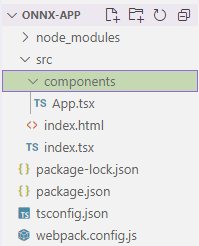
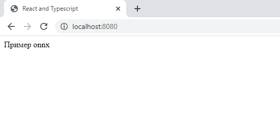
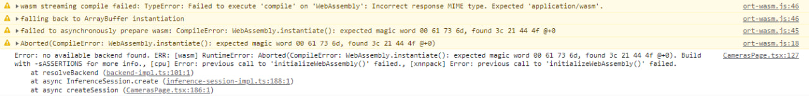
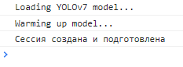
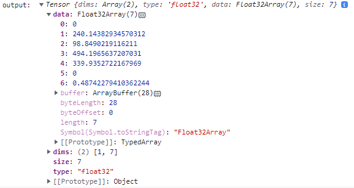
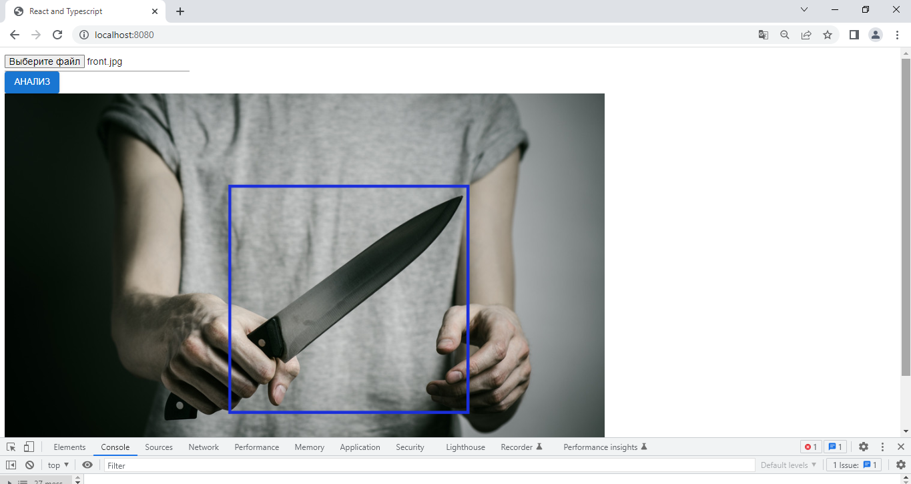

# Пример по использованию ONNX YOLOv7 в TS

## 1. Сборка приложения

1) В терминале в папке приложения `onnx-app` выполнить `npm init –y`.

2) Заменить содержимое `package.json` на следующее:
```json
{
  "name": "onnx-app",
  "version": "1.0.0",
  "description": "",
  "main": "index.js",
  "scripts": {
    "test": "echo \"Error: no test specified\" && exit 1",
    "dev": "SET NODE_OPTIONS=--openssl-legacy-provider && SET NODE_ENV=development && webpack-dev-server",
    "start": "SET NODE_ENV=production && webpack"
  },
  "keywords": [],
  "author": "",
  "license": "ISC",
  "dependencies": {
    "@emotion/react": "^11.11.0",
    "@emotion/styled": "^11.11.0",
    "@mui/icons-material": "^5.11.16",
    "@mui/material": "^5.13.0",
    "@reduxjs/toolkit": "^1.9.5",
    "@techstark/opencv-js": "^4.7.0-release.1",
    "@types/react": "^18.2.6",
    "@types/react-dom": "^18.2.4",
    "@types/react-router-dom": "^5.3.3",
    "axios": "^1.4.0",
    "clean-webpack-plugin": "^4.0.0",
    "copy-webpack-plugin": "^11.0.0",
    "css-loader": "^6.7.3",
    "html-webpack-plugin": "^5.5.1",
    "onnxruntime-web": "^1.14.0",
    "react": "^18.2.0",
    "react-dom": "^18.2.0",
    "react-redux": "^8.0.5",
    "react-router": "^6.11.1",
    "react-router-dom": "^6.11.1",
    "regenerator-runtime": "^0.13.11",
    "style-loader": "^3.3.2",
    "ts-loader": "^9.4.2",
    "typescript": "^5.0.4",
    "webpack": "^5.82.1",
    "webpack-cli": "^5.1.1",
    "webpack-dev-server": "^4.15.0",
    "webpack-notifier": "^1.15.0"
  }
}

```
3) Установить зависимости. Для этого в терминале в корне проекта выполнить `npm install`.

4) В корне проекта создать файл `webpack.config.js` со следующим содержанием:
```ts
const path = require("path");
const HtmlWebpackPlugin = require('html-webpack-plugin');

const paths = {
    src: path.resolve(__dirname, 'src'),
    dist: path.resolve(__dirname, 'dist')
};

module.exports = {
    context: paths.src,
    mode: "development",

    entry: {
        app: './index'
    },

    output: {
        path: paths.dist,
        filename: '[name].bundle.js',
        publicPath: '/'
    },

    resolve: {
        extensions: ['.ts', '.tsx', '.js', '.jsx'],
        fallback: {
          fs: false,
          path: false,
          crypto: false
        }
    },

    devServer: {
      historyApiFallback: true,
    },

  plugins: [
    new HtmlWebpackPlugin({
        template: './index.html'
    }),
  ],

  module: {
    rules: [
        {
            test: /\.tsx?$/,
            use: [
                {
                    loader: "ts-loader",
                    options: {
                      compilerOptions: {
                        noEmit: false,
                      },
                    },
                },
            ],
        },
      {
        test: /\.css$/,
        use: [
            {
                loader: "style-loader",
            },
          {
            loader: "css-loader",
          }
        ]
      },
      {
        test: /\.(png|svg|jpg|gif)$/,
        use: ["file-loader"]
      }
    ]
  }
};
```
5) В корне проекта создать файл `tsconfig.json` со следующим содержанием:
```json
{
    "compilerOptions": {
      "target": "es5",
      "allowJs": true,
      "skipLibCheck": true,
      "esModuleInterop": true,
      "allowSyntheticDefaultImports": true,
      "strict": true,
      "forceConsistentCasingInFileNames": true,
      "noFallthroughCasesInSwitch": true,
      "module": "esnext",
      "moduleResolution": "node",
      "resolveJsonModule": true,
      "isolatedModules": true,
      "noEmit": true,
      "jsx": "react-jsx"
    },
    "include": [
      "src",
      "types"
    ]
}
```
6) Проверить, что приложение собирается. Создадать папку `src` в корне проекта. В папке `src` создаем папку components. В ней создаем файл `App.tsx`:
```ts
import React from "react";

export const App = () => {
    return (
        <div>
            Пример onnx
        </div>
    )
}
```
В папке `src` создать файл `index.tsx`:
```ts
import React from "react";
import ReactDOM from 'react-dom';
import { App } from "./components/App";

ReactDOM.render(
    <App/>,
    document.getElementById('root')
);
```
В папке `src` создать файл `index.html`:
```html
<!DOCTYPE html>
<html lang="en">
<head>
    <meta charset="UTF-8">
    <title>React and Typescript</title>
</head>
<body>
    <div id="root"></div>
</body>
</html>
```
Структура проекта на данном этапе должна выглядеть следующим образом:



В терминале в корне проекта запустить `webpack-dev-server`: `npm run dev`. Перейти по указанной при запуске ссылке. Ожидаемый результат:



## 2. Экспорт модели
1) Для экспорта модели в формат onnx использовать: https://github.com/augmentedstartups/yolov7.

2) Важно экспортировать модель с правильными параметрами, чтобы на выходе был читабельный массив. Пример правильной команды:
```
python export.py --weights path/to/model.pt --grid --end2end --simplify \
        --topk-all 100 --iou-thres 0.65 --conf-thres 0.35 --img-size 640 640 --max-wh 640
```

Пример неправильной команды:
```
python export.py --weights path/to/model.pt
```
3) Полученный файл `model.onnx` помещаем в папку `src`. В данном примере используется модель YOLOv7 для распознавания объектов на изображении.

## 3. Настройка Webpack для работы с onnxruntime-web
1) Для работы `onnxruntime-web` необходимо внести дополнительные настройки в файл `webpack.config.js`. Для этого понадобится `copy-webpack-plugin`:
```ts
const CopyPlugin = require("copy-webpack-plugin");
```

2) В plugins добавить:
```ts
new CopyPlugin({
      patterns: [
          { from: '../node_modules/onnxruntime-web/dist/*.wasm', to: '[name][ext]' },
          { from: './model.onnx', to: '[name][ext]'}
      ]
  })
```

3) В случае неправильной настройки может появиться следующая ошибка:
```
«Error: no available backend found. ERR: [wasm] RuntimeError: Aborted(CompileError: WebAssembly.instantiate(): expected magic word 00 61 73 6d, found 3c 21 44 4f @+0). Build with -sASSERTIONS for more info., [cpu] Error: previous call to 'initializeWebAssembly()' failed., [xnnpack] Error: previous call to 'initializeWebAssembly()' failed.»
```



4) Итоговое содержание `webpack.config.js`:
```ts
const path = require("path");
const HtmlWebpackPlugin = require('html-webpack-plugin');
const CopyPlugin = require("copy-webpack-plugin");

const paths = {
    src: path.resolve(__dirname, 'src'),
    dist: path.resolve(__dirname, 'dist')
};

module.exports = {
    context: paths.src,
    mode: "development",

    entry: {
        app: './index'
    },

    output: {
        path: paths.dist,
        filename: '[name].bundle.js',
        publicPath: '/'
    },

    resolve: {
        extensions: ['.ts', '.tsx', '.js', '.jsx'],
        fallback: {
          fs: false,
          path: false,
          crypto: false
        }
    },

    devServer: {
      historyApiFallback: true,
    },

  plugins: [
    new HtmlWebpackPlugin({
        template: './index.html'
    }),
    new CopyPlugin({
      patterns: [
          { from: '../node_modules/onnxruntime-web/dist/*.wasm', to: '[name][ext]' },
          { from: './model.onnx', to: '[name][ext]'}
      ]
  })
  ],

  module: {
    rules: [
        {
            test: /\.tsx?$/,
            use: [
                {
                    loader: "ts-loader",
                    options: {
                      compilerOptions: {
                        noEmit: false,
                      },
                    },
                },
            ],
        },
      {
        test: /\.css$/,
        use: [
            {
                loader: "style-loader",
            },
          {
            loader: "css-loader",
          }
        ]
      },
      {
        test: /\.(png|svg|jpg|gif)$/,
        use: ["file-loader"]
      }
    ]
  }
};
```

## 4. Создание сессии и подготовка модели
1) В `App.tsx` будет содержать простой интерфейс с возможностью загрузки изображения и кнопкой анализа. На данном этапе при нажатии на кнопку анализа будет осуществляться проверка типа загруженного файла. `App.tsx`:
```ts
import React from "react";
import { useState } from "react";
import { Input, Button } from "@mui/material";

export const App = () => {
    const [file, setFile] = useState<File>();

    const onFileChange = (event: React.ChangeEvent<HTMLInputElement>) => {
        const target = event.target as HTMLInputElement;
        if (target) setFile(target.files![0]);
    }

    const onFileUpload = async () => {
        if ((file == undefined)||(file?.type != "image/jpeg")) {
            console.log("Загрузите изображение в формате jpg");
            return;
        }
        console.log("Изображение успешно загружено");
    }

    return (
        <div>
            <div>
                <Input type="file" onChange={onFileChange}/>
            </div>
            <div>
                <Button variant={"contained"} onClick={onFileUpload}>
                    Анализ
                </Button>
            </div>
        </div>
    )
}
```

Проверка результата. Запустить: `npm run dev`. Открыть DevTools в браузере, перейти во вкладку Console. На странице загрузить файл, нажав на кнопку “Выберите файл”, а затем на кнопку “Анализ”. В консоли должно быть сообщение: “Изображение успешно загружено”.

2) Для использования модели в приложении необходимо создать сессию и подготовить модель. Для этого используется библиотека `opencv-js` и `onnxruntime-web`. Добавить в `App.tsx` следующий код:
```ts
. . .
import cv from "@techstark/opencv-js";
import { Tensor, InferenceSession } from "onnxruntime-web";

export const App = () => {
    const [session, setSession] = useState<InferenceSession>();

    . . .

    const modelName = "./model.onnx";
    const modelInputShape = [1, 3, 640, 640];

    cv["onRuntimeInitialized"] = async () => {
        // create session
        console.log("Loading YOLOv7 model...");
        const yolov7 = await InferenceSession.create(modelName);

        // warmup main model
        console.log("Warming up model...");
        const tensor = new Tensor(
            "float32",
            new Float32Array(modelInputShape.reduce((a, b) => a * b)),
            modelInputShape
        );
        await yolov7.run({ images: tensor });

        setSession(yolov7);
        console.log("Сессия создана и подготовлена");
    };

    . . .

    return (
        . . .
    )
}
```

Проверка результата. Запустить: `npm run dev`. Открыть DevTools в браузере, перейти во вкладку Console. Дождаться появления сообщений о загрузке модели:



## 5. Подготовка входных данных и запуск модели
1) Для того чтобы запустить анализ, необходимо подготовить входные данные, т.е. преобразовать изображение в тензор. Для этого нужно запустить функцию предобработки для загруженного изображения и преобразовать ее в тензор. Для отображения изображения на странице добавим элемент `canvas`. Итак, нужно добавить в `App.tsx` следующий код:
```ts
. . .

export const App = () => {

    . . .

    const onFileUpload = async () => {

        . . .

        const image = new Image;
        image.src = URL.createObjectURL(file!);

        image.onload = async () => {
            var canvas = document.getElementById('img1') as HTMLCanvasElement;
            var ctx = canvas!.getContext('2d', { willReadFrequently: true });

            canvas.width = image.width;
            canvas.height = image.height;

            var xRatio1 = canvas.width / 640; // set xRatio1
            var yRatio1 = canvas.height / 640; // set yRatio1

            ctx!.drawImage(image!, 0, 0, canvas.width, canvas.height);

            const [modelWidth, modelHeight] = modelInputShape.slice(2);
            const [input, xRatio, yRatio] = preprocessing(image!, modelWidth, modelHeight);
            const tensor = new Tensor("float32", new cv.Mat(input).data32F, modelInputShape); // to ort.Tensor

            const { output } = await session!.run({ images: tensor }); // run session and get output layer

            console.log('output: ', output);
        }
    }

    const preprocessing = (source: HTMLImageElement, modelWidth: number, modelHeight: number) => {
        const mat = cv.imread(source); // read from img tag
        const matC3 = new cv.Mat(mat.rows, mat.cols, cv.CV_8UC3); // new image matrix
        cv.cvtColor(mat, matC3, cv.COLOR_RGBA2BGR); // RGBA to BGR
     
        // padding image to [n x n] dim
        const maxSize = Math.max(matC3.rows, matC3.cols); // get max size from width and height
        const xPad = maxSize - matC3.cols, // set xPadding
          xRatio = maxSize / matC3.cols; // set xRatio
        console.log('matC3.cols ', matC3.cols);
        const yPad = maxSize - matC3.rows, // set yPadding
          yRatio = maxSize / matC3.rows; // set yRatio
        console.log('matC3.rows ', matC3.rows);
        console.log('maxSize ', maxSize);
        const matPad = new cv.Mat(); // new mat for padded image
        cv.copyMakeBorder(matC3, matPad, 0, yPad, 0, xPad, cv.BORDER_CONSTANT); // padding black
     
        const input = cv.blobFromImage(
          matPad,
          1 / 255.0, // normalize
          new cv.Size(modelWidth, modelHeight), // resize to model input size
          new cv.Scalar(0, 0, 0),
          true, // swapRB
          false // crop
        ); // preprocessing image matrix
     
        // release mat opencv
        mat.delete();
        matC3.delete();
        matPad.delete();
     
        return [input, xRatio, yRatio];
    };

    return (
        <div>

            . . .

            <div>
                <canvas id="img1"></canvas>
            </div>
        </div>
    )
}
```

Проверка результата. Запустить: `npm run dev`. Откроыть DevTools в браузере, перейти во вкладку Console. Дождаться появления сообщений о загрузке модели. На странице загрузить файл, нажав на кнопку “Выберите файл”, а затем на кнопку “Анализ”. На странице должна отобразиться загруженная картинка:


В консоли должно появиться значение `output`, которое вернула модель после анализа изображения. `output` имеет размерность *[n, 7]*, где *n* - количество обнаруженных объектов. В полученном массиве для каждого обнаруженного объекта указаны координаты области изображения, на которой обнаружен объект, класс объекта и score. Пример возможного `output`:



## 6. Обработка результата
1) Обработка полученного `output` нужна, чтобы нарисовать на изображении рамки по заданным координатам вокруг обнаруженных объектов. Для это нужно добавить в `App.tsx` следующий код:
```ts
. . .

export const App = () => {

    . . .

    const onFileUpload = async () => {

        . . .

        image.onload = async () => {

            . . .

            const boxes = [];

            // looping through output
            for (let r = 0; r < output.size; r += output.dims[1]) {
                const data = output.data.slice(r, r + output.dims[1]); // get rows
                const x0 = data.slice(1)[0];
                const y0 = data.slice(1)[1];
                const x1 = data.slice(1)[2];
                const y1 = data.slice(1)[3];
                const classId = data.slice(1)[4];
                const score = data.slice(1)[5];

                const w = Number(x1) - Number(x0),
                h = Number(y1) - Number(y0);

                boxes.push({
                    classId: classId,
                    probability: score,
                    bounding: [Number(x0) * Number(xRatio) * Number(xRatio1), Number(y0) * Number(yRatio) * Number(yRatio1), w * Number(xRatio) * Number(xRatio1), h * Number(yRatio) * Number(yRatio1)],
                });
            }

            boxes.forEach((box) => {
                const [x1, y1, width, height] = box.bounding;
                ctx!.strokeStyle = '#1a2edb'; // тёмно-синий цвет
                ctx!.lineWidth = 5; // толщина линии в 5px
                ctx!.strokeRect(x1, y1, width, height);
            });
        }
    }

    . . .

    return (

        . . .

    )
}
```

Проверка результата. На странице загрузить файл, нажав на кнопку “Выберите файл”, а затем на кнопку “Анализ”. На странице должна отобразиться загруженная картинка с нарисованной рамкой (если `output` не пустой):

